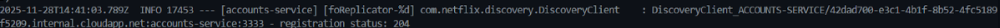
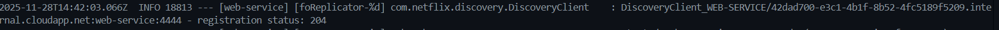
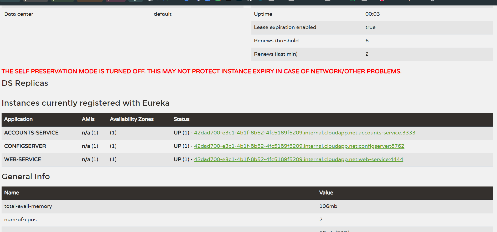
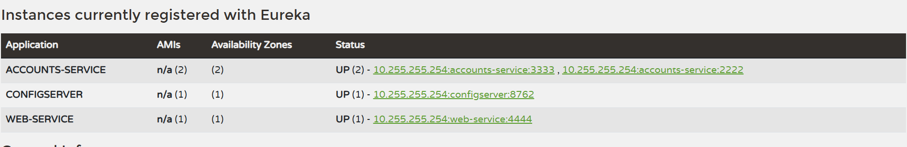
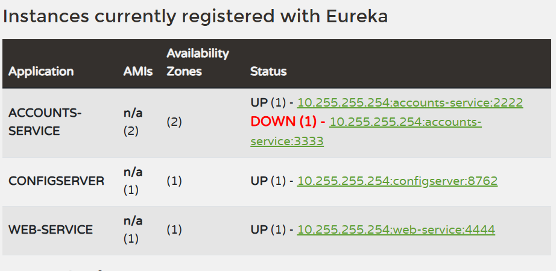
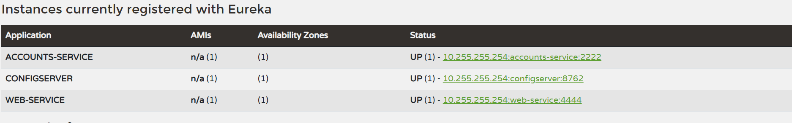

# Lab 6 Microservices - Project Report

## 1. Configuration Setup

**Configuration Repository**: [Link to your forked repository]
https://github.com/Javiersusin/lab6-microservices-Javiersusin.git
Describe the changes you made to the configuration:

- What did you modify in `accounts-service.yml`?
He modificado el puerto que estaba en 3333 a 2222 para crear un segundo cliente (accounts), ver asi como es capaz de trabajar con dos instancias del mismo servicio. De esta manera vemos como el balanceador de carga funciona correctamente.
- Why is externalized configuration useful in microservices?
Para que cada servicio pueda tener su propia configuración y no tener que estar modificando el código fuente para cambiar parámetros como puertos, URLs, etc. Facilita la gestión y despliegue de servicios en diferentes entornos.
En definitiva, permite que la escalabilidad sea más sencilla ya que puedes adaptar cada servicio a sus necesidades sin afectar a los demás.
---

## 2. Service Registration (Task 1)

### Accounts Service Registration

Explain what happens during service registration.
Cada servicio que lanzamos se comunica con el servidor Eureka para registrarse. Eureka responde confirmando que el servicio ha sido registrado correctamente y ahora está disponible para ser descubierto por otros servicios. Sabemos que los servicios están activos o no gracias al envío de latidos. Esto nos permite definir en nuestra aplicación la tolerancia a errores y el balanceo de carga.
### Web Service Registration

Explain how the web service discovers the accounts service.
Cuando el servicio web se inicia, también se registra en Eureka. Luego, cuando necesita comunicarse con el servicio de cuentas, consulta a Eureka para obtener la ubicación (URL) del servicio de cuentas registrado. Eureka responde con la información necesaria, permitiendo que el servicio web se conecte al servicio de cuentas sin necesidad de conocer su ubicación exacta de antemano.
---

## 3. Eureka Dashboard (Task 2)

Describe what the Eureka dashboard shows:

- Which services are registered?
- El de configuración(configserver), accounts-service y web-service. Y otro de accounts-service en el puerto 2222.
- What information does Eureka track for each instance?

- Zonas disponibles, (1)
- Estado de la instancia (UP/DOWN)
- Dirección IP y puerto

---

## 4. Multiple Instances (Task 4)

Answer the following questions:

- What happens when you start a second instance of the accounts service?
- Cuando se inicia una segunda instancia del servicio ACCOUNTS-SERVICE, Eureka la detecta y la registra como una instancia adicional del mismo servicio. Cada instancia aparece con un puerto diferente (por ejemplo, 3333 y 2222).
  No se produce ningún error, ya que Eureka permite múltiples instancias del mismo servicio para mejorar la disponibilidad y el balanceo de carga.

- How does Eureka handle multiple instances?
- Eureka guarda todas las instancias registradas bajo el mismo nombre de servicio, formando lo que se conoce como un service registry.
  Cuando otro servicio (por ejemplo, el Web Service) necesita llamar a ACCOUNTS-SERVICE, Eureka devuelve una lista con todas las instancias disponibles y el cliente realiza la conexión utilizando un mecanismo de load balancing.
  Si una instancia falla o se apaga, Eureka la elimina automáticamente después del período de timeout, manteniendo el sistema funcional sin interrupciones.

- How does client-side load balancing work with multiple instances?
- El balanceo de carga en el lado del cliente funciona gracias a que el cliente obtiene desde Eureka la lista de todas las instancias disponibles del servicio. En lugar de enviar las peticiones siempre a la misma instancia, el cliente (por ejemplo, el Web Service) distribuye las solicitudes entre las distintas instancias registradas.
---

## 5. Service Failure Analysis (Task 5)

### Initial Failure

-Describe what happens immediately after stopping the accounts service on port 3333.
-Justo después de detener la instancia del servicio ACCOUNTS-SERVICE que estaba funcionando en el puerto 3333, el servicio Web (WEB-SERVICE) continúa intentando enviar solicitudes a esa instancia porque todavía aparece registrada en Eureka.
Durante unos segundos, el Web Service recibe errores o mensajes indicando que el servicio no está disponible.
Esto ocurre porque Eureka no elimina la instancia inmediatamente: primero debe detectar su fallo. En nuestro caso la descartamos después de mostrar el estado de DOWN durante un segundo.

### Eureka Instance Removal

Explain how Eureka detects and removes the failed instance:

- How long did it take for Eureka to remove the dead instance?
- En mi caso, Eureka tardó aproximadamente 2 minutos en eliminar la instancia caída del registro después de que dejara de recibir latidos de esa instancia.
- What mechanism does Eureka use to detect failures?
- Como ya he explicado anteriormente, Eureka utiliza un mecanismo de latidos (heartbeats) para monitorear el estado de las instancias registradas.
  Cada instancia envía periódicamente señales a Eureka para indicar que está activa. Si una instancia deja de enviar estos latidos durante un período de tiempo determinado, Eureka la marca como "DOWN".
  Después de un tiempo adicional (1 segundo en nuestro caso), si la instancia sigue sin responder, Eureka la elimina del registro.
---

## 6. Service Recovery Analysis (Task 6)

Answer the following questions:

- Why does the web service eventually recover?
- Sí, el Web Service se recupera automáticamente después de que Eureka elimine la instancia caída del registro.
  Después de ese periodo, el Web Service deja de intentar conectarse a la instancia caída y comienza a usar únicamente la instancia que sigue activa, recuperándose y funcionando nuevamente sin errores.
- How long did recovery take?
- El tiempo depende del ciclo de latidos (heartbeat) y del mecanismo de expiración del cliente, me ha tardado casi 3 minutos.
- What role does client-side caching play in the recovery process?
- Es el que permite mantener una lista actualizada de las instancias disponibles. Cuando una instancia falla, el cliente (Web Service) utiliza la información en caché para evitar intentar conectarse a la instancia caída, lo que facilita la recuperación rápida del servicio.
---

## 7. Conclusions

Summarize what you learned about:

Durante este laboratorio he experimentado de forma práctica cómo funciona una arquitectura basada en microservicios utilizando Spring Cloud, Eureka y configuración centralizada. Una de las principales ventajas observadas es que cada servicio funciona de manera independiente, lo que permite escalabilidad, despliegues individuales y tolerancia a fallos sin afectar al resto del sistema.

El uso de Eureka como servicio de descubrimiento ha sido clave para evitar depender de direcciones fijas. Gracias a él, los servicios pueden registrarse dinámicamente y descubrirse entre sí, lo que permite balanceo de carga automático entre múltiples instancias y recuperación en caso de fallos. También he podido comprobar cómo el sistema es capaz de detectar instancias caídas mediante el mecanismo de heartbeats y eliminarlas automáticamente tras un periodo de expiración.

---

## 8. AI Disclosure

- Yes, la he usado para ayudarme a redactar este informe, siempre lo redacto yo mismo y después se lo envío a ChatGPT para que lo escriba de manera formal y profesional.
- Además, la he utilizado para que me ayudase a utilizar gradlew en wsl, ya que no lo tenía instalado y no sabía como hacerlo.
---

## Additional Notes

Any other observations or comments about the assignment.

